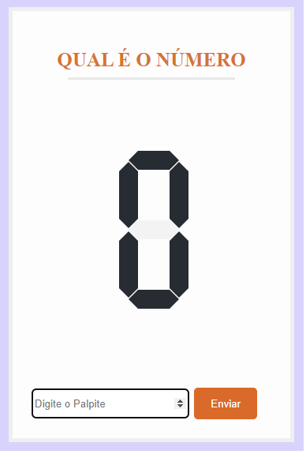
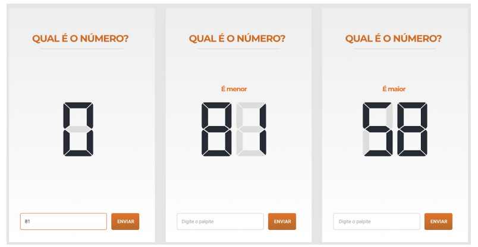
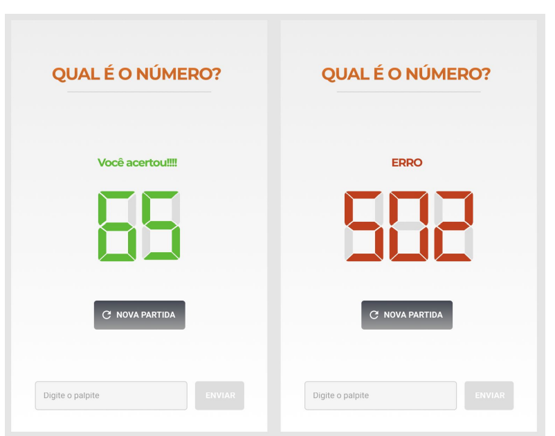

<h1 align="center">Qual é o numero</h1>

  

  <a href="#-sobre">Sobre</a>&nbsp;&nbsp;&nbsp;|&nbsp;&nbsp;&nbsp;
  <a href="#-projeto">Projeto</a>&nbsp;&nbsp;&nbsp;|&nbsp;&nbsp;&nbsp;
  <a href="#-tecnologias">Tecnologias</a>&nbsp;&nbsp;&nbsp;|&nbsp;&nbsp;&nbsp;
  <a href="#-implementação">Implementação</a>&nbsp;&nbsp;&nbsp;|&nbsp;&nbsp;&nbsp;
  <a href="#-autor">Autor</a>

## ✨ Sobre

Desafio proposto pela Studio Sol, para cria um aplicação e acertar o numero sem usar nenhuma fonte ou biblioteca externa.

O projeto em produção pode ser acessado por [aqui](https://diegohfcelestino.github.io/qual-e-o-numero/).

## ✨ Projeto

O  problema consiste em receber um número através de uma requisição e implementar um jogo para acertar este número através de palpites. Ao errar um palpite, irá ser informado se o número obtido é maior ou menor do que o palpite feito. O palpite realizado ou status code de erro de requisição devem ser exibidos na tela no formato de LED de 7 segmentos. O palpite será obtido como entrada em um campo de texto, que deverá ser processado apenas quando o botão ENVIAR for clicado.
Para solucionar o problema proposto, foi implementado a solução utilizando, HTML, CSS e Javascript puro. 
Abaixo estão as telas do projeto.

  
  

## ✨ Implementação

#### Segmentos:
- Três displays para apresentar os números e que são de 1 a 300.
- É apresentado erro 502 quando a requisição falha.
- Foi tratado os números negativos, zero e acima de 300, o zero é excluído quando o usuário tenta digitar, negativo e acima de 300 é mostrado um alerta na tela.
- O resultado do display ignora os zeros a esquerda.
###### Botão NOVA PARTIDA:
- O botão fica visível apenas quando tem erro ao receber o número ou quando o jogador acertou o palpite.
###### Campo de entrada
- é exibido o texto "Digite o palpite" como placeholder
- O valor aparece nos segmentos assim que o botão ENVIAR for clicado e o input é resetado para o estado inicial.
- O botão de enviar fica desabilitado quando tem erro ao receber o número ou quando o jogador acertou o palpite. O usuário deve clicar em "NOVA
PARTIDA" neste caso.

## ✨ Tecnologias

- [HTML](https://developer.mozilla.org/pt-BR/docs/Web/HTML)
- [CSS](https://developer.mozilla.org/pt-BR/docs/Web/CSS)
- [JavaScript](https://developer.mozilla.org/en-US/docs/Web/JavaScript)

## ✨ Autor

Feito por **Diego Henrique Ferreira**.
Entre em contato!

